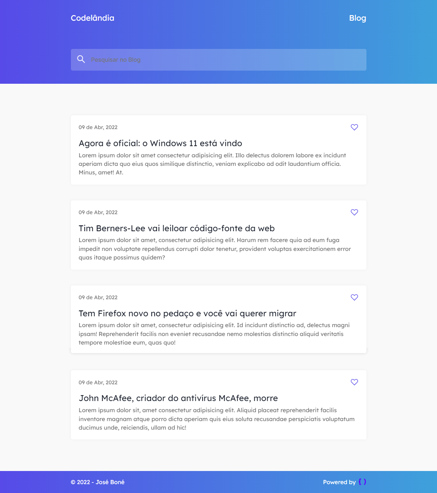

<h1 align="center">Codelândia Blog</h1>

<div align="center" id="top"> 
  

&#xa0;

<a href="https://blog-jose-bone.vercel.app">Demo</a>

</div>

Status

<h4 align="center">
	🚧  Codelândia Blog 🚀 Under construction...  🚧
</h4>

<hr>

<p align="center">
  <a href="#dart-about">About</a> &#xa0; | &#xa0; 
  <a href="#white_check_mark-requirements">Requirements</a> &#xa0; | &#xa0; 
  <a href="#bookmark-layout">Layout</a> &#xa0; | &#xa0;
  <a href="#checkered_flag-starting">Starting</a> &#xa0; | &#xa0;
  <a href="#memo-license">License</a> &#xa0; | &#xa0;
  <a href="https://github.com/jose-bone" target="_blank">Author</a>
</p>

<br>

## :dart: About

Blog creation challenge 💻📱🚀

## :white_check_mark: Requirements

Before starting :checkered_flag:, you need to have [Git](https://git-scm.com) and [VSCode](https://code.visualstudio.com) installed.

## :bookmark: Layout

You can view the project layout through this [link](<https://www.figma.com/file/z5zyEXaOeCJxB34SH0P28f/Desafios---Codel%C3%A2ndia-(Copy)?node-id=0%3A1>). [Figma](https://www.figma.com/) must be counted to access it.

## :checkered_flag: Starting

```bash
# Clone this project
$ git clone https://github.com/jose-bone/codelandia-challenges.git

# Access
$ cd codelandia-challenges/blog
```

## :memo: License

This project is under license from MIT. For more details, see the [LICENSE](../LICENSE.md) file.

Made with :heart: by <a href="https://github.com/jose-bone" target="_blank">José Boné</a>

&#xa0;

<a href="#top">Back to top</a>
