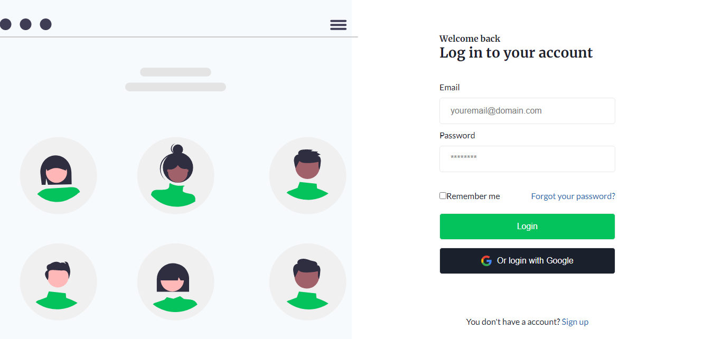
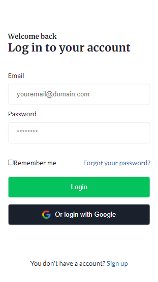

<h1 align="center">Login</h1>

 
  

&#xa0;

<a href="https://jbonelogin.vercel.app">Demo Link</a>

  <a href="#dart-about">About</a> &#xa0; | &#xa0; 
  <a href="#computer-preview">Preview</a> &#xa0; | &#xa0; 
  <a href="#memo-license">License</a> &#xa0; | &#xa0;
  <a href="https://github.com/jose-bone" target="_blank">Author</a>

 

## :dart: About

Login interface, responsibly for Desktop and mobile devices. Made with HTML and CSS.

## :computer: Preview

## :memo: License

This project is under license from MIT. For more details, see the [LICENSE](../LICENSE.md) file.

Made with :heart: by <a href="https://github.com/jose-bone" target="_blank">José Boné</a>

&#xa0;

<a href="#top">Back to top</a>
